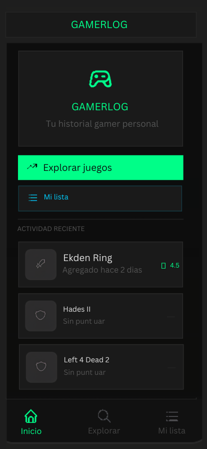
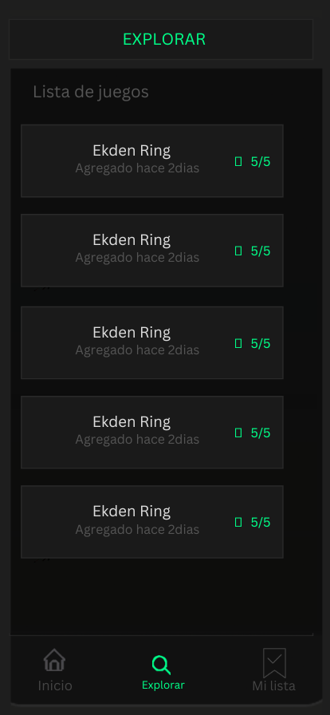
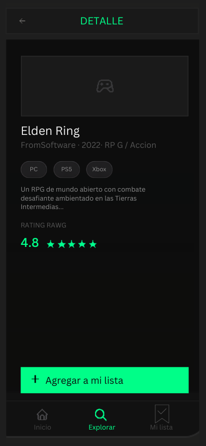
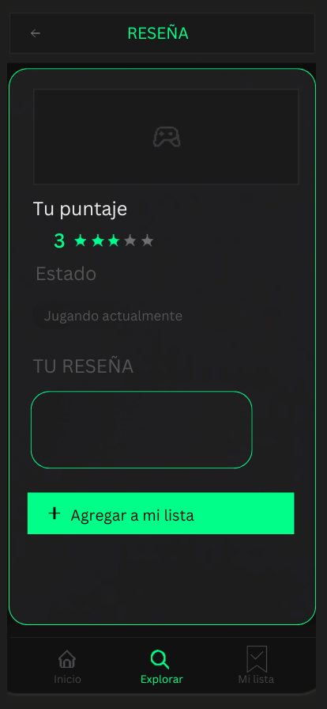
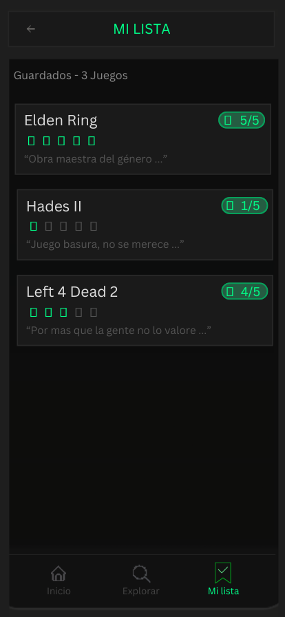

# Desarrollo Móvil - GamerLog 🎮

## 👥 Integrantes

- Guillermo Valenzuela
- Lucas Garcia Carrera


## 📖 Descripción

GamerLog es una aplicación móvil simple desarrollada con React Native y Expo que consume una API de juegos y funciona como una cartelera de videojuegos al estilo IMDb.
Dentro de la aplicación podemos ver una lista de juegos, guardar los títulos en una lista personal y dejar reseñas con puntuaciones propias.


## 🌐 API Utilizada

La API que utilizamos para esta aplicación es:
- https://rawg.io/apidocs

Credits to: © RAWG, Behind The Games


## 🚀 Funcionalidades
✔ Explorar videojuegos desde RAWG  
✔ Buscar juegos por nombre  
✔ Ver detalle completo  
✔ Guardar juegos localmente  
✔ Crear reseñas y puntuaciones  
✔ Persistencia local con AsyncStorage  
✔ Navegación móvil con tabs y stacks


## 📱 Pantallas

- __Inicio:__ logo de acceso rápido a explorar y a tu lista, y un bloque de actividad reciente (Esto estará guardado en el storage del dispositivo).

- __Explorar:__ Barra de búsqueda + listado de juegos populares desde la API de RAWG con rating y género.

- __Detalle:__ Info del juego (plataforma, descripción, rating de RAWG) y un botón para agregar a tu lista (storage).

- __Mi lista:__ Todos los juegos guardados, con tu puntaje personal, estrellas y reseña resumida.

- __Puntuar/Reseña:__ Formulario controlado con estrellas interactivas, estado del juego y campo de reseña, este es el que cumple el requerimiento del formulario del TP.

La aplicación utiliza Expo Router combinando:
- Tabs para navegación principal
- Stack para pantallas internas


## 🧱 Estructura Utilizada

```txt
src/
├── app/              # Pantallas y navegación
├── components/       # Componentes reutilizables
├── constants/        # Configuración visual y theme
├── hooks/            # Hooks personalizados
├── services/         # API y storage
├── types/            # Tipos TypeScript
```


## ⚙️ Instalación y ejecución

### 1. Clonar el repositorio
`bash`
```
git clone https://github.com/GaugeZich/GamerLog.git
```


### 2. Movernos adentro del directorio
`bash`
```
cd gamerlog
```


### 3. Iniciar el proyecto
`bash`
```
npx expo start
```


### 4. Configurar .env
Crear el archivo .env en la raiz del proyecto y configurar la key
```
EXPO_PUBLIC_RAWG_KEY=
```

### 5. Iniciar el proyecto
`bash`
```
npx expo start
```


### 6. Conexión al proyecto

Dentro de Expo Go (Si no cuenta con la aplicación móvil debe descargarla desde Google Play/App Store) le damos a "Scan QR code" y escaneamos el código QR que se genera al iniciar el proyecto.


## 📚 Tecnologías

- React Native
- Expo
- TypeScript
- AsyncStorage
- RAWG API
- Expo Vector Icons


## 🖌️ Diseños

Diseños realizados en la aplicación Canva:
- https://canva.link/fbja2aabqph227j

### Inicio


### Explorar


### Detalle


### Reseña


### Mi Lista


